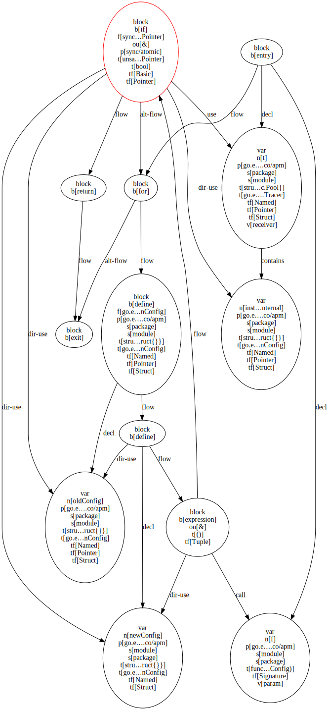

# unsafe-go-classifier

Classification models for `unsafe` usages in Go code.

## 1. Dev environment

Use the `run.sh` script to start a fully-featured development container.
It contains a CUDA-enabled Tensorflow installation, a JupyterLab server (at port `8888`) along with all other required dependencies.

To fix the login token of the Jupyter server, you can either set the `JUPYTER_TOKEN` environment variable or simply put the token in a file of the same name in the root directory of this project.
The Jupyter port can be changed via the `JUPYTER_PORT` variable.

The `attach_shell.sh` script can be used to start a bash shell in the running dev container.
If `root` is passed as the first argument, a root shell is started.

## 2. Running evaluations

To run the experiments, simply run the `evaluate.sh` script.
By default it will evaluate multiple combinations of [models](./src/usgoc/evaluation/models.py) and [dataset representations](./src/usgoc/evaluation/datasets.py).
The evaluated configurations can be restricted via a number of command line args.
Run `./evaluate.sh --help` to get more information about them.

After running the evaluation, the results can be inspected by starting an MLFlow webserver via `start_mlflow.sh`, or by querying the results SQLite database located at `mlflow.db`.

## 3. Perform predictions on new data

After running the evaluations, as described in the previous section, the trained models are all serialized to disk (can be found in the `mlruns` directory).
The best performing of those models can be selected for inclusion in a standalone prediction container by running `./evaluate.sh --export --model [MODEL_NAME] [...optional other filters]`.
This will create an `exported_models` directory which contains the selected models (multiple models can be selected by passing more than one `--model` option).
Note that the evaluation of the selected models **must be completed** before trying to export them.

A prediction container with the exported models can be built with the `build_pred.sh` script (will be tagged `usgoc/pred:latest`).

Before running the prediction container, two Docker volumes should be created: `go_mod` and `go_cache`.
They will be used to persist Go dependencies between runs.
The prediction container additionally needs access to the Go projects for which predictions should be produced.
Set the `PROJECTS_DIR` environment variable to the absolute path of the directory which contains the projects that will be analyzed; this directory will be automatically mounted by the prediction script.

The prediction container can be run via `./predict.sh [global opts] [cmd] [cmd opts]`.
It takes the following arguments:
- **Global opts:** Options that apply to all commands supported by the prediction container.
  - `--project`: 
      The path to the project which directly or indirectly contains an unsafe usage you want to analyzed.
      The path must be relative to `PROJECTS_DIR`.
  - `--module` (optional):
      The module which contains the unsafe usage (this might be the module name of the project or one of its dependencies).
      If not provided, the package name will be used instead (see `--package`).
  - `--package`:
      The package which contains the unsafe usage to be analyzed.
  - `--file`:
      The name of the Go file inside the given package.
      If the file you want to analyze is a Go cache file (inside `.cache/go-build`), set file to `.cache`.
      The relevant code will then be searched via the `--snippet`. 
  - `--line`:
      The line number in the given file which contains the unsafe usage.
  - `--snippet` (optional):
      The Go code at the given line. While providing this argument is always recommended, it is only then required if `--file` is set to `.cache`.
      In all other cases, the snippet is just used to verify that that the correct code was found.
  - `--dist` (optional, default=`0`):
      The maximum allowed distance between the Go declaration (function, type, signature, etc.) which contains `--snippet` that is closest to `--line`.
      If zero, the snippet must lie within the selected declaration.
      If larger than zero, the declaration containing the snippet can start/end a few lines after/before `--line`.
      Set to `-1` to allow an arbitrarily high distance (not recommended).
  - `--cache-dist` (optional, default=`3`):
      Like `--dist`.
      This distance is used as a fallback only for cache files (i.e. only if `--file .cache`) **if** no matching declaration could be found in the container's Go cache at the specified line.
      This can happen because slight environmental differences (Go patch version, CGO configuration etc.) can affect the number of pragma comments etc.
  - `--go-version` (optional, default=`1.14.3`):
      The Go version that should be used.
      Mostly only relevant for unsafe usages in Go core or CGO cache files.
      By default, the version that was used when labeling the dataset is used. 
      Additionally, the prediction container also comes with version `1.17`.
  - `--convert-mode` (optional, default=`atomic_blocks`): 
      Specifies the type of CFG representation that should be used for the selected code.
      `atomic_blocks` will represent each statement as a single vertex, `split_blocks` will represent all expressions inside the statements as individual nested vertices.
- **Cmds:**
  - `show --format [json (default)|dot]`: 
      Outputs the CFG for the selected usage as JSON or in Graphviz dot format.
  - `predict --model [model name] [--conformal-alpha [alpha, default=0]] [--limit-id [id, default=v127_d127_f127_p127)]] [--logits]`: 
      Outputs the prediction of the selected model as JSON.
      The `conformal-alpha` parameter specifies whether conformal prediction results should be shown.
      By default no conformal sets are produced. 
      To obtain conformal sets, an error threshold `0 < alpha < 1` has to be provided; the smaller the alpha value, the larger the prediction sets will be (`0.1` is a good default choice).
      The `limit_id` specifies how the data associated with individual CFG nodes should be mapped to binary dimensions.
      If the `--logits` flag is set, prediction logits will be returned instead of normalized probabilities.
      Note that only combinations of models, limit ids and convert modes that were exported when building the prediction container will work.
      The `predict` command will only utilize the CPU. 

### Examples

To visualize the CFG for a given usage, the following pipeline can be used:
```bash
./predict.sh \
  --project elastic/beats --package go.elastic.co/apm --file config.go \
  --line 413 --snippet "unsafe.Pointer(oldConfig)," \
  show -f dot \
| dot -Tsvg \
| display
```
<p align="center"></p>

This only works if [Graphviz](https://graphviz.org/) (for `dot`) and [ImageMagick](https://imagemagick.org/index.php) (for `display`) are installed on the host system.

An unsafe usage can be classified as follows:
```bash
./predict.sh \
  --project elastic/beats --package go.elastic.co/apm --file config.go \
  --line 413 --snippet "unsafe.Pointer(oldConfig)," \
  predict -m WL2GNN -a 0.1 2>/dev/null \
| jq
```
Prediction output for both labels (exact probabilites might vary):
```json
{
  "probabilities": [{
    "cast-basic": 0.000799796252977103,
    "cast-bytes": 0.00023943622363731265,
    "cast-header": 0.0008311063284054399,
    "cast-pointer": 0.00024363627017010003,
    "cast-struct": 0.0023890091106295586,
    "definition": 0.0012677970807999372,
    "delegate": 0.9921323657035828,
    "memory-access": 0.001111199613660574,
    "pointer-arithmetic": 0.0008071911288425326,
    "syscall": 9.69868924585171e-05,
    "unused": 8.147588232532144e-05
  }, {
    "atomic": 0.9911662936210632,
    "efficiency": 0.00020463968394324183,
    "ffi": 0.003083886345848441,
    "generics": 0.0015664942329749465,
    "hide-escape": 0.0027959353756159544,
    "layout": 0.0004991954774595797,
    "no-gc": 6.399328412953764e-05,
    "reflect": 4.1643997974460945e-05,
    "serialization": 0.0004356006102170795,
    "types": 9.241054794983938e-05,
    "unused": 4.988365981262177e-05
  }],
  "conformal_sets": [
    ["delegate"],
    ["atomic"]
  ]
}
```
[jq](https://stedolan.github.io/jq/) is of course optional here. Also, `2>/dev/null` might not be the the right choice for production use 🙂.
Note that the output format differs if `--conformal-alpha 0` (`-a 0`) is used;
in this case, no conformal sets are produced, and the resulting JSON only contains the two probability maps (i.e. the value at `probabilites` in the above example output).
